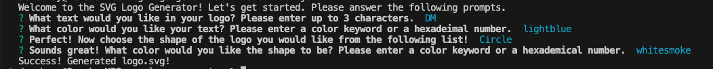

# SVG Logo Generator  

## Description 
When creating a website or application, you may need a logo to represent your project or webpage. This Node.js command-line application will take in user input to generate a logo and save it as an SVG file. The application prompts the user to select a color and shape, provide text for the logo, and save the generated SVG to a `.svg` file.

## Table of Contents 
- [Walkthrough Video](#walkthrough-video)
- [Installation](#installation)
- [Usage](#usage)
- [Contributing](#contributing)
- [Testing](#testing)
- [License](#license)
- [Questions](#questions)

## Walkthrough Video 
Click the following link to view a walktrhough video on the usage of the application: [SVG Logo Generator Video](https://drive.google.com/file/d/13JhJsfkH9xm004z9TQHjxntQE2g7D15-/view)  

## Installation 
1. Clone this repository to your local machine. (For reference, visit the [Cloning a Repository](https://docs.github.com/en/repositories/creating-and-managing-repositories/cloning-a-repository) GitHub Docs article.)
2. Run `npm install` in your CLI to download the npm package dependencies. 
3. Run `node index.js` on your CLI to run the application.

## Usage 
When the program is initialized, you will be prompted to answer a series of questions about the logo you want. This includes the text, text color, shape, and shape color.  
  
Once all the questions have been answered, `fs.writeFile()` is used to generate an svg file based on your answers. The generated file will be written to the relative `examples/` directory.  
  
### Screenshot of CLI on Use 

## Contributing
To make contributions to this project:  
1. Fork the repository  
2. Make some commits to improve the application
3. Open a Pull Request on GitHub
4. From there, we can discuss your changes and merge the pull request once your contributions have been approved!

## Testing 
I've written some test scripts for this project, which can be found in the `test/` directory.  
Before you run the test suites, ensure that you have downloaded the project package dependencies in the [Installation](#installation) section.  
When you're ready to run the tests, go to your CLI and run `npm test`.

## License 
This GitHub repository is licensed under the MIT license. Please refer to the license documentation [here](https://opensource.org/licenses/MIT).

## Questions
This project was created by [dymoy](https://github.com/dymoy).  
For any related questions, please contact me via email at <derekymoy@gmail.com>.
